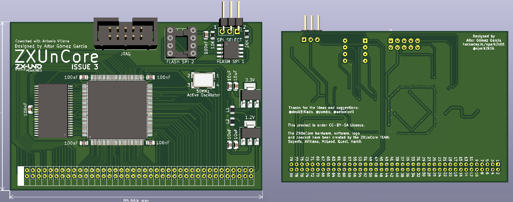
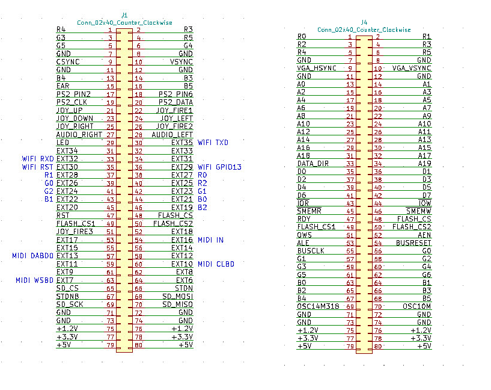

# ZXUno4ALL

License is Creative Commons by SA.

PINOUT (ZXUNO RGB666) / GRAPHICS GREMLIN
----------------------------------------

Spanish
-------

Se trata de un proyecto que hace uso de la FPGA Xilinx Spartan XC6SLX9-2TQG144C y ha sido desarrollado con la finalidad de ser 100% compatible con los cores desarrollados para el ZXUno. Los esquemáticos están basados en éste, gracias al trabajo previo que llevó a cabo K_Mirror con la migración del proyecto del ZXUno 4.1 a KiCad.

A diferencia del ZXUno original, ZXUnCore tiene un formato modular y está pensado para facilitar la integración en otros proyectos derivados del mismo, dentro del proyecto global denominado ZXUno4ALL. No obstante, al quedar expuestos casi todos los pines I/O de la FPGA, éste puede ser utilizado en otros proyectos basados en esta FPGA.

ZXUnCore dispone de un conector de 2x40 pines y paso de 2.0mm, lo cual hace posible que se pueda conectar encima o debajo del backplane del proyecto derivado de forma horizontal. También vertical u horizontal al mismo nivel de la base del proyecto derivado, empleando en este caso un conector de ángulo recto o acodado.

English
-------

This is a project that uses the Xilinx Spartan XC6SLX9-2TQG144C FPGA and has been developed with the aim of being 100% compatible with the cores developed for the ZXUno. The schematics are based on this, thanks to the previous work carried out by K_Mirror with the migration of the project from ZXUno 4.1 to KiCad.

Unlike the original ZXUno, ZXUnCore has a modular format and is designed to facilitate integration into other projects derived from it, within the global project called ZXUno4ALL. However, since almost all the I/O pins of the FPGA are exposed, it can be used in other projects based on this FPGA.

ZXUnCore has a 2x40-pin connector and 2.0mm pitch, which makes it possible to connect above or below the backplane of the derived project horizontally. Also vertically or horizontally at the same level as the base of the derived project, in this case using a right-angle or angled connector.
