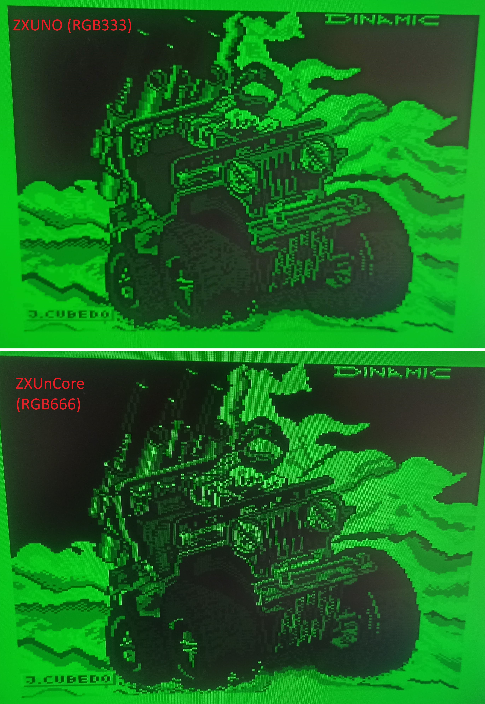

Amstrad CPC464 Core
-------------------

Este core es obra de mcleod-ideafix.

Hace uso de RGB666 para mejora de la opción monocromática (tecla END). Ahora se visualizan correctamente todas las tonalidades del Amstrad CPC, y está disponible en verde, ambar, B&W y color:

A continuación se muestran las diferencias a nivel monocromático del ZXUnCore respecto al ZXUno original, gracias al nuevo DAC de RGB666:

It makes use of RGB666 to enhance the monochrome option (END key). Now all the shades of the Amstrad CPC are displayed correctly, and it is available in green, amber, B&W and color. 
The monochromatic differences of the ZXUnCore compared to the original ZXUno are also shown, thanks to the new RGB666 DAC
