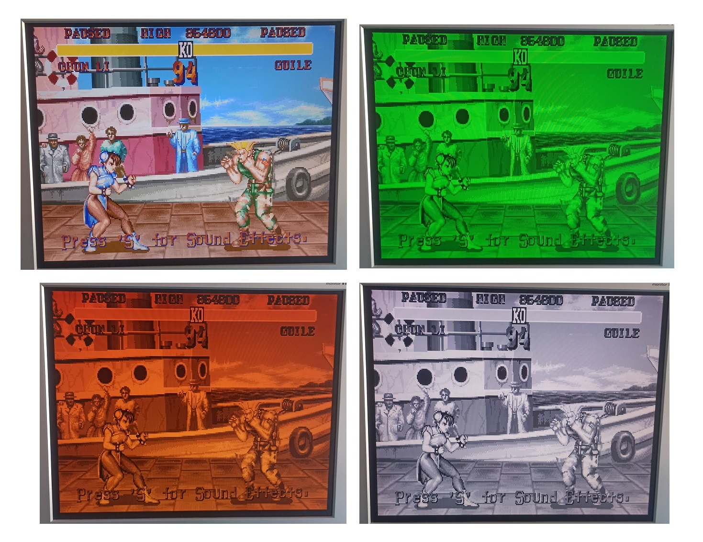

PCXT Core
---------

Este core es obra de Nicolae Dumitrache (https://opencores.org/projects/next186_soc_pc), y fue adaptado al ZXUno por @DistWave (https://www.zxuno.com/forum/viewtopic.php?f=56&t=1197)

La versión para ZXUnCore hace uso de RGB666, y he añadido la opción monocromática (tecla Bloq Despl). Para obtener la mejor precisión de cálculo de luminancia sin comprometer el proceso de refresco de los pixeles de la señal de VGA, he procedido a implementar tres mapas de 64 x 6 bits con el valor ponderado para cada uno de los componentes RGB:

This core is the work of Nicolae Dumitrache (https://opencores.org/projects/next186_soc_pc), and was adapted to the ZXUno by @DistWave (https://www.zxuno.com/forum/viewtopic.php?f=56&t=1197)

The version for ZXUnCore makes use of RGB666, and I have added the monochrome option (Scroll Lock key). To obtain the best luminance calculation precision without compromising the refreshment process of the pixels of the VGA signal, I have proceeded to implement three 64 x 6-bit maps with the weighted value for each of the RGB components.
