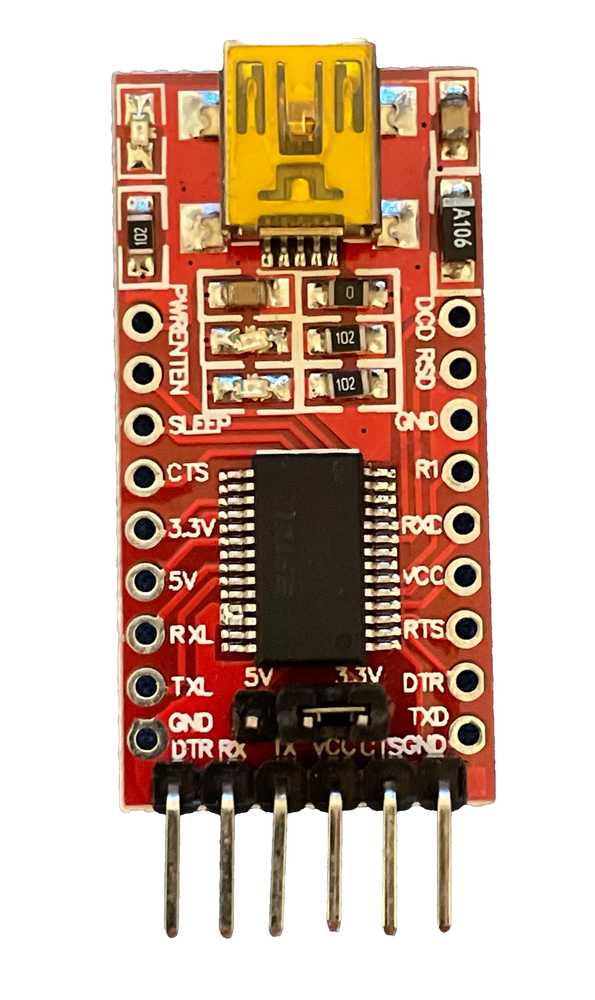
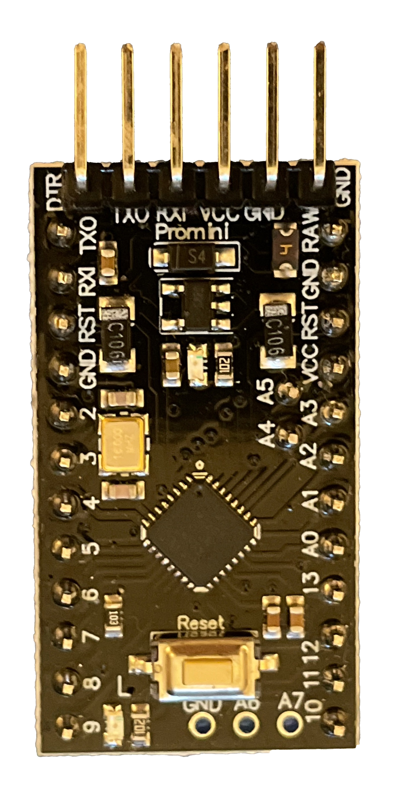

== Keyboard modes

The default is ZX Spectrum mode. To change to a different mode, you must press `Caps Shift+Symbol Shift+F`, then `U`, and then the key for the desired mode. After doing that, some text is automatically typed, to show the selected mode (for example `.zx` if you press `Caps Shift+Symbol Shift+F`, `U`, and then `1`).

[align="center",width="40%",%header,cols=2*]
|===
|Mode
|Key
|ZX Spectrum
|`0`
|Amstrad CPC
|`1`
|MSX
|`2`
|Commodore 64
|`3`
|Atari 800XL
|`4`
|BBC Micro
|`5`
|Acorn Electron
|`6`
|Apple (I and II)
|`7`
|Commodore VIC 20
|`8`
|PC XT
|`9`
|Oric Atmos
|`A`
|SAM Coupé
|`B`
|Jupiter ACE
|`C`
|Sega Master System
|`D`
|Commodore 16 / Plus 4
|`E`
|HT-1080Z / Video Genie / TRS-80 Model I G – Galaksija
|`F`
|Galaksija
|`G`
|Multicomp
|`H`
|===

<<<

The ZX keyboard mode can behave in two different ways, which you can switch using `Caps Shift+Symbol Shift+F` and then `D`:

- Conventional mode, with access to the original `Caps Shift` and `Symbol Shift` but no access to special keys or modifier keys.
- Full mode, without access to `Caps Shift` or `Symbol Shift` but access to special and modifier keys just like the other keyboard modes.

In general, the keyboard layout (except on `ZX` conventional mode), showing the keypress obtained when combining `Caps Shift+Symbol Shift` (in full mode), is resumed here:

[align="center",width="80%",cols=10*]
|===
^|**1**
^|**2**
^|**3**
^|**4**
^|**5**
^|**6**
^|**7**
^|**8**
^|**9**
^|**0**
^|`F1`
^|`F2`
^|`F3`
^|`F4`
^|`F5`
^|`F6`
^|`F7`
^|`F8`
^|`F9`
^|`F10`
^|**Q**
^|**W**
^|**E**
^|**R**
^|**T**
^|**Y**
^|**U**
^|**I**
^|**O**
^|**P**
^|`F11`
^|`F12`
^|`*`
^|`-`
^|`Print Screen`
^|`Scroll Lock`
^|`Pause`
^|`Shift Lock`
^|`([ and ^)`
^|`+ (* and ])`
^|**A**
^|**S**
^|**D**
^|**F**
^|**G**
^|**H**
^|**J**
^|**K**
^|**L**
^|**Enter**
^|`Shift`
^|`< and >`
^|`+`
^|
^|`Insert`
^|`Start`
^|`Page Up`
^|`Ñ`
^|`´ ({ and ¨)`
^|`ç (})`
^|**CShift**
^|**Z**
^|**X**
^|**C**
^|**V**
^|**B**
^|**N**
^|**M**
^|**SShift**
^|**Space**
^|
^|`Ctrl`
^|`Win`
^|`Alt`
^|`Del`
^|`End`
^|`Page Down`
^|`Alt Gr`
^|
^|
|===

[TIP]
====
You don't have to stop pressing `Caps Shift+Symbol Shift` when combining modidier keys (e.g. for `Mayús.+F10` with `Caps Shift+Symbol Shift+A`, and `Caps Shift+Symbol Shift+0`).
====

[TIP]
====
Pressing `Caps Shift+Symbol Shift+F`, `U`, and an invalid key , types the name of the current mode.
====

[NOTE]
====
The source code, binaries and more instructions about the keyboard firmware can be found at https://github.com/spark2k06/zxunops2/tree/master/Alternative[the offical repository].
====

[TIP]
====
`Caps Shift+Symbol Shift+I` behaves differently on the following cores:

- Commodore 16 and VIC-20:  `Num Lock`
- Commodore Pet: `Menu` key (next to `Alt Gr`), used as `Shift Lock`
====

[CAUTION]
====
It's not recommended to use the `PC XT` mode, while also using a PS/2 keyboard
====

<<<

== Functions

Pressing `Caps Shift+Symbol Shift+F` and then a special key, enables several special functions.

The full function list is this one:

[align="center",width="100%",%header,cols="1,10,3"]
|===
|Key
|Action
|Compatible Modes
|V
|Type Version
|All
|X
|Save config to EEPROM
|All
|B
|`Ctrl+Alt+Bcksp` (Hard Reset)
|All
|N
|`Ctrl+Alt+Del` (Soft Reset)
|All
|Y
|`Ctrl+Alt+F5` (NMI)
|ZX, CPC, Jupiter, SAM, ZX80, ZX81
|O
|`F12` followed by `Shift` with a 1 sec. pause
|BBC
|H
|`F8+F10`
|Atari
|U
|Change keyboard mode
|All
|C
|Map `O`, `P`, `Q`, `A` keys to the keypad (Atari) or cursor keys
|PC, MSX, SMS and Atari
|D
|Enable and disable full ZX keyboard mode
|ZX
|G
|Change video mode
|ZX, Atari, BBC, VIC, ORIC and HT-1080Z
|===

`C` function enables or disables mapping the cursor keys to `O`, `P`, `Q`, `A` and `M` is exchanged with `Space`. It works with all keyboard modes execept:

- C64 and Atari 800XL modes: instead of cursor keys, the map is to `8`, `4`, `6` and `2` of the keypad, and `M` to key `0` (fire)
- Jupiter ACE: instead of cursor keys, the map is to `8`, `4`, `6` and `2` of the keypad, and `M` and 'Space' are exchanged.

All keyboard modes try to match most of their symbols to those printed on the Spectrum keyboard. This way `Symbol Shit+M` obtains “.” or `Symbol Shift+K` obtains `+`. On some keyboards, a few symbols have been changed for more useful ones. For example, on version 1.3 spanish MSX, `Symbol Shift+E` obtains “¡” and `Symbol Shift+I` obtains “¿”.

<<<

== Firmware update

In order to install the firmware, a computer is needed (Windows, Mac, Linux).

*Hardware needed*:

- Computer (Windows, Mac, Linux)
- 6 https://en.wikipedia.org/wiki/Jump_wire[jump wires] (if possible, female on both sides)
- USB serial adapter (FTDI)

[.text-center]

*Software needed*:

- https://github.com/binaryupdates/xLoader[XLoader] (only for Windows) or https://www.nongnu.org/avrdude/[AVRDUDE] (you can use the embeded version in https://www.arduino.cc/en/software[Arduino IDE]).
-`.hex` binary file for the firmware version to install, which you can download from https://github.com/spark2k06/zxunops2/tree/master/Alternative/binaries[the official repository] (usually, the file is one whoe name ends with `-328.hex`).

<<<

*Preparation*

Unplug the Arduino board (if needed), and locate all the conections.

[.text-center]

Plug the serial adapter with the Arduino board, using this guide:

[%header,cols=2*]
|===
|USB FTDI
|Arduino Mini
|`DTR`
|`DTR`
|`RX`
|`TXO`
|`TX`
|`RXI`
|`VCC` (3.3V)
|`VCC`
|`CTS`
|`GND`
|`GND`
|`GND`
|===

[TIP]
====
If the arduino board uses 5V for power, you can make also the connection using that instead of 3.3V
====

Plug the USB adapter to the computer, and find out the connected port (`COM`, `/dev/usb...`, etc.).

<<<

=== xLoader

Choos the following parameters:

- Device: Duemilanove/Nano (ATMega328)
- Baud rate: 57600
- Port: COM port for the adapter

Click "Upload" and wait until a message is shown saying "xx bytes uploaded".

=== AVRDUDE

Use a command with this syntax:

[source,shell]
----
avrdude -U flash:w:<firmwre file.hex>:i -e -p atmega328p -b 57600 -c arduino -P <USB port>
----

[TIP]
====
When using the `avrdude` binary included with Arduino IDE, you also have to add the path to the included `.conf` file. For example, on MacOS:

`/Applications/Arduino.app/Contents/Java/hardware/tools/avr/bin/avrdude -U flash:w:zxunops2-25092021-328.hex:i -e -p atmega328p -b 57600 -c arduino -P /dev/cu.usbserial-A50285BI -C /Applications/Arduino.app/Contents/Java/hardware/tools/avr/etc/avrdude.conf`
====	
